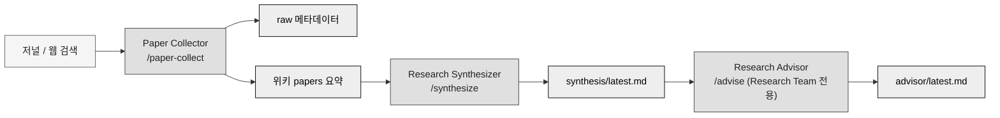
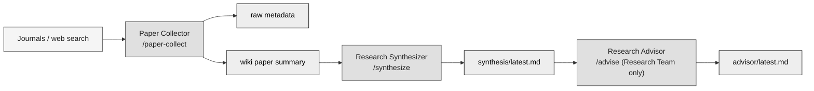

# research-agent-office (리서치 에이전트 오피스)


[](#research-agent-office-리서치-에이전트-오피스)
[](#english)

Claude Code 기반 **AI Agent 파이프라인**입니다. 논문을 자동으로 검색해 팀별로 완전히
독립된 위키(**Obsidian Vault**)에 정리하고, 축적된 위키를 다시 분석해 **연구 동향
종합**과 **연구자 자신의 연구에 대한 인사이트**를 만듭니다.

이 저장소는 파이프라인 코드(위키 운영 규칙과 커맨드)만 담은 공개용 템플릿입니다.
실제 팀 목록, 수집한 논문, 연구 내용 같은 개인 데이터는 이 저장소에 없고 별도의
private 저장소에서 관리합니다. 이 구조를 그대로 가져다 자신의 연구에 쓰고 싶은
사용자를 위한 버전입니다.

## 핵심 기능

- **Journal Watch**: 특정 저널을 지정하거나, 저널 없이 관심 분야만 지정해서 매일
  논문 3~4편을 수집합니다. 팀 전체에서 정확히 1개만 존재하는 고정 팀입니다.
- **Research Team**: 사용자가 원하는 만큼 만들 수 있는 팀입니다. 각 팀은 독립된
  주제, 키워드, 검색 조건, 위키를 가지며, 매일 논문을 수집하고 종합한 뒤 사용자
  자신의 연구와 연결한 인사이트까지 생성합니다.
- 모든 팀은 `teams.json` 레지스트리 하나에 등록되는 동적 구조이므로, 팀을 자유롭게
  추가·삭제·수정할 수 있습니다.
- 논문 원본 메타데이터와 AI가 작성한 해석을 물리적으로 분리된 위치에 저장해서, 어느
  부분이 검증된 사실이고 어느 부분이 AI 해석인지 항상 추적할 수 있습니다.

## 동작 원리



### 파이프라인 한눈에 보기

| 단계 | 커맨드 | 무엇을 하는가 | 스킬 연동 | 산출물 |
|---|---|---|---|---|
| 1. Paper Collector | `/paper-collect <team-id>` | 팀 설정(저널/주제/키워드)과 연구 프로필 기준으로 신규 논문을 웹에서 찾아 사용자 확인을 받고, 전문을 확보한 논문만 정식 반영 | 논문 요약 페이지의 Research Framework 다이어그램을 그릴 때 로컬 프로젝트 스킬 `markdown-mermaid-writing`의 스타일 가이드(그레이스케일 팔레트, subgraph 복잡도 등급)를 따릅니다 | `raw/{slug}.json`, `papers/{slug}.md`, 관련 `concepts/`·`comparisons/` 갱신, 전문 미확보 논문은 `wanted.md` |
| 2. Research Synthesizer | `/synthesize <team-id>` | 팀 위키 전체(papers/concepts/comparisons)를 다시 읽고 연구 동향 종합을 전면 재작성 | 외부 플러그인 `academic-research-skills`의 `deep-research` 스킬을 lit-review/quick 모드로 호출해, 지금까지 모은 논문의 검색 커버리지와 놓친 축이 없는지 점검받습니다. 점검 결과는 이 프로젝트의 Synthesis 템플릿 형식으로 다시 정리해서 씁니다(deep-research의 자체 출력 형식을 그대로 붙여넣지 않습니다) | `synthesis/latest.md` (이전 버전은 `synthesis/history/`로 이동) |
| 3. Research Advisor | `/advise <team-id>` (Research Team 전용) | 방금 만든 synthesis와 이 팀의 연구 프로필(`my-research.md`)을 근거로, 사용자 자신의 연구와 연결한 이론적 고찰·research gap·시사점을 작성 | Research Gap 초안의 각 후보를 `deep-research` 스킬 quick 모드로 점검해, 이 팀의 위키 밖 문헌에서 이미 다뤄진 주제는 아닌지 확인합니다(경고 신호일 뿐 gap을 기각하는 용도는 아닙니다) | `advisor/latest.md` (이전 버전은 `advisor/history/`로 이동) |

세 단계 각각이 정확히 무엇을 하는지는 아래에서 자세히 설명합니다.

### 1단계, Paper Collector (`/paper-collect <team-id>`)

**역할**: 팀이 관심 있는 논문을 웹에서 찾아, 원문을 실제로 읽을 수 있는 것만
위키에 정식으로 반영하는 수집 담당입니다.

1. 팀 설정을 확인합니다. Journal Watch 타입 팀은 저널 목록(또는 저널 없이 분야만
   지정된 상태)을, Research Team은 주제, 키워드, 그리고 이 팀의 연구
   프로필(`my-research.md`)을 확인합니다.
2. 팀의 `raw/` 폴더에 이미 있는 논문 slug 목록을 만들어 중복 수집을 방지합니다.
3. WebSearch와 WebFetch로 후보 논문을 찾습니다. 저널이 지정되어 있으면 해당 저널의
   최신 호를 직접 확인하고, 지정되어 있지 않으면 arXiv, Semantic Scholar, OpenAlex
   같은 무료 오픈 소스로 검색합니다. 저널 지정 없이 검색할 때는 impact factor가
   높거나 해당 분야에서 저명한 저널에 실린 논문을 우선합니다. Research Team이면
   `topic`과 `keywords`로 만든 기본 검색에 더해, 연구 프로필의 "이론적 배경"과
   "방법론"에 나오는 이론·개념·방법론·데이터 소스와 관련된 논문도 찾습니다. 단순
   키워드 일치가 아니라 이 연구를 실제로 수행하는 데 필요한 참고문헌인지를
   기준으로 판단합니다.
4. 하루 목표 편수(기본 3~4편)만큼 신규 후보를 추려 사용자에게 먼저 보여주고
   확인받습니다. 자동 실행으로 전환되기 전까지 유지되는 안전장치입니다.
5. 확인된 논문마다 **전문(full text) 확보를 먼저 시도합니다.** 오픈 액세스
   논문(arXiv, 오픈 액세스 저널, PMC, 기관 리포지토리 등)이면 WebFetch로 전문을
   직접 읽고, 그 내용을 근거로 방법론·핵심 기여·한계를 구체적으로 정리해 raw
   메타데이터와 위키 논문 요약 페이지를 작성합니다. 이 요약 페이지의 Research
   Framework 섹션(연구 파이프라인을 mermaid 다이어그램으로 그리는 부분)은 항상
   로컬 프로젝트 스킬 `markdown-mermaid-writing`의 스타일 가이드를 따릅니다.
   **초록만 확보되는 논문은 raw와 위키에 아예 반영하지 않습니다.** 페이월 등으로
   전문에 실제로 접근할 수 없으면, 이 팀의 연구와 관련성이 높아 보이는 논문만
   골라 `wanted.md`에 후보로 올리고 나머지는 건너뜁니다. 관련 개념 페이지를
   갱신하거나 새로 만들고, 기존 논문과 방법론적으로 대조되는 지점이 있으면
   비교 페이지도 갱신합니다.

**산출물**: `raw/{slug}.json`(사실 정보만), `papers/{slug}.md`(AI 해석 요약, 6개
섹션 고정 템플릿), 관련 `concepts/`·`comparisons/` 갱신, 전문을 못 구한 논문은
`wanted.md`.

페이월에 막혀 전문을 못 구한 논문은 `wanted.md`에서 확인하고, PDF를 직접 구했다면
`/paper-review-pdf <team-id>`를 씁니다. 팀의 `raw/` 폴더에 넣어둔 PDF 중 아직
처리되지 않은 파일을 찾아 전문을 읽고 반영하며, 반영에 성공하면 `wanted.md`에서도
해당 항목을 제거합니다. 이 경로도 Research Framework 다이어그램 작성 시 같은
`markdown-mermaid-writing` 스타일 가이드를 따릅니다. 동작 방식은 아래 "PDF 원문
직접 반영" 절에서 자세히 설명합니다.

### 2단계, Research Synthesizer (`/synthesize <team-id>`)

**역할**: 팀 위키에 쌓인 논문들을 한 걸음 물러나서 다시 읽고, 개별 논문 요약만
봐서는 안 보이는 연구 동향을 종합하는 담당입니다.

1. 팀의 `papers/`, `concepts/`, `comparisons/`를 전부 읽습니다. 논문이 한 편도
   없으면 `/paper-collect`를 먼저 실행하라고 안내하고 중단합니다.
2. **`deep-research` 스킬 연동**: 가능하면 Skill 도구로 외부 플러그인
   `academic-research-skills`의 `deep-research`를 lit-review 또는 quick 모드로
   호출해, 지금까지 모은 논문들의 검색 커버리지가 충분한지, cross-source
   synthesis 관점에서 놓친 축은 없는지 점검받습니다. (`skillDirectories`
   설정이 해석되지 않아 Skill 도구 목록에 안 보이는 세션이면, 같은
   `academic-research-skills` 플러그인의 `deep-research/SKILL.md`를 직접 Read해서
   그 방법론만 참고하는 폴백을 씁니다 - 아래 "스킬 연동" 절 참고.) 어느 경로든
   최종 산출물은 이 프로젝트의 Synthesis 템플릿 형식으로 다시 씁니다.
3. 기존 `synthesis/latest.md`가 있으면 `synthesis/history/{date}.md`로 옮깁니다.
4. 최근 연구 동향, 핵심 개념 지도, 주요 방법론, emerging topics, 다루는 논문
   전체 목록을 담아 `synthesis/latest.md`를 전면 재작성합니다. 부분 수정이 아니라
   매번 새로 쓰는 방식입니다.
5. `index.md`의 "Synthesis" 섹션과 최근 갱신 이력을 갱신합니다.

**산출물**: `synthesis/latest.md` (이전 버전은 `synthesis/history/`로 보존).

### 3단계, Research Advisor (`/advise <team-id>`, Research Team 전용)

**역할**: 방금 만든 연구 동향 종합을, 이 팀을 운영하는 사용자 자신의 연구와
직접 연결해서 "그래서 내 연구에는 무엇을 뜻하는가"를 답하는 담당입니다. Journal
Watch 타입 팀에는 이 단계와 연구 프로필 자체가 없습니다 - 특정 연구 주제에
묶이지 않는 팀이기 때문입니다.

1. 팀의 `pipeline` 배열에 `advisor`가 없으면(Journal Watch 팀이면) 중단합니다.
2. `synthesis/latest.md`가 없으면 `/synthesize`를 먼저 실행하라고 안내합니다.
3. `my-research.md`(연구 프로필)를 읽습니다. 비어 있으면 `/my-research-setup`으로
   채워달라고 안내하되, 있는 정보만으로 최대한 진행합니다.
4. `synthesis/latest.md`와 팀 위키 전체(papers/concepts/comparisons)를 읽습니다.
5. 기존 `advisor/latest.md`가 있으면 `advisor/history/{date}.md`로 옮깁니다.
6. 내 연구와의 관계, 이론적 고찰, Research Gap, 주요 비교/개념, 최근 트렌드가
   내 연구에 주는 시사점을 담아 `advisor/latest.md` 초안을 작성합니다. 모든
   주장은 팀 위키의 `[[slug]]`로 근거를 표시합니다.
7. **`deep-research` 스킬 연동(Research Gap 검증)**: 6번에서 초안으로 뽑은 각
   Research Gap 후보마다 `deep-research` 스킬을 quick 모드로 호출해, 이 팀의
   위키 밖 더 넓은 문헌에서 이미 다뤄진 주제는 아닌지 점검받습니다. 이 점검은
   gap을 기각하기 위한 게 아니라 **경고 신호**입니다 - 이미 상당히 다뤄진
   주제로 확인되면 서술을 좁히거나 가장 가까운 기존 연구를 함께 언급하고,
   미개척 영역으로 확인되면 그대로 유지합니다. 이 단계에서 찾은 문헌은 원문을
   확보해 위키에 정식 반영하지 않습니다 - Research Gap 서술의 신뢰도를 높이는
   용도로만 씁니다.
8. 검증 결과를 반영해 `advisor/latest.md`를 확정합니다.
9. `index.md`의 "Advisor" 섹션과 최근 갱신 이력을 갱신합니다.

**산출물**: `advisor/latest.md` (이전 버전은 `advisor/history/`로 보존).

## 스킬 연동

이 파이프라인은 외부 플러그인 스킬 하나와 로컬 프로젝트 스킬 하나, 두 가지 방식으로
Claude Code의 Skill 생태계를 씁니다.

| 스킬 | 연동 방식 | 어느 커맨드가 쓰는가 | 용도 |
|---|---|---|---|
| `deep-research` (외부 플러그인 `academic-research-skills`) | `.claude/settings.json`의 `skillDirectories`로 이 프로젝트 범위에서만 연결. Skill 도구로 호출을 시도하고, 세션에 아직 로드되지 않아 Skill 도구 목록에 안 보이면 해당 플러그인 폴더의 `SKILL.md`를 직접 Read해서 그 방법론만 참고하는 폴백을 씁니다 | `/synthesize` (lit-review/quick 모드로 검색 커버리지 점검), `/advise` (quick 모드로 Research Gap 후보를 위키 밖 문헌과 대조 검증), `/my-research-setup` (Socratic guided research dialogue 모드로 연구 질문 정식화), `/concept-review` (quick 모드로 병합/재구성 후보 재검토) | 이 네 커맨드 모두 deep-research의 결과를 그대로 붙여넣지 않고, 이 프로젝트 자체의 템플릿 형식으로 재구성해서 씁니다 |
| `markdown-mermaid-writing` (로컬 프로젝트 스킬, `.claude/skills/` 아래 직접 복제) | `.claude/skills/` 아래 있으면 `skillDirectories` 설정 없이도 자동 인식되므로, 위 폴백 경로가 필요 없습니다 | `/paper-collect`, `/paper-review-pdf` (논문 요약 페이지의 Research Framework 다이어그램 작성 시) | subgraph 복잡도 등급, `classDef` 색상 규칙, 접근성(`accTitle`/`accDescr`) 스타일 가이드를 그대로 따르되, 이 프로젝트는 그레이스케일 4단 팔레트로 커스터마이즈해서 씁니다 |

저널 우선순위 판단(어떤 저널이 해당 분야에서 저명한지)에는 `academic-research-skills`
플러그인의 `academic-paper-reviewer` 참고 자료(`top_journals_by_field.md`)도
함께 씁니다. 정확한 연동 규칙은 [`schema/schema.md`](schema/schema.md)의 "외부
스킬 연동" 섹션에 전부 정의되어 있습니다.

## 위키 구성

각 팀의 위키는 사용자가 지정한 Obsidian Vault 폴더 아래 7개 하위 항목으로
구성됩니다. 각 문서의 정확한 형식과 갱신 규칙은
[`schema/schema.md`](schema/schema.md)에 전부 정의되어 있습니다.

| 폴더/파일 | 내용 | 갱신 방식 |
|---|---|---|
| `papers/` | 논문 1편당 요약 페이지 1개. 연구문제, 방법론, 핵심 기여, 한계, 관련 개념, 관련 논문 6개 섹션으로 고정된 템플릿을 따릅니다. | Paper Collector가 논문마다 신규 생성 |
| `concepts/` | 여러 논문에 공통으로 등장하는 개념 페이지. 기본형(정의, 배경, 대표 방법론, 관련 논문)으로 시작해서, 여러 논문이 공통으로 전제하거나 분야의 전통적 개념이거나 앞으로도 계속 참조될 토대 개념이면 확장형(보편적 설명과 논문별 등장 방식 섹션 추가)으로 승격됩니다. | Paper Collector가 관련 논문이 나올 때마다 갱신 |
| `comparisons/` | 두 개 이상의 방법론이나 논문을 대조하는 페이지. 비교 기준 표와 결론으로 구성됩니다. | Paper Collector가 방법론적 대조점을 발견할 때 생성/갱신 |
| `synthesis/latest.md` | 팀 위키 전체를 분석한 연구 동향 종합. 최근 연구 동향, 핵심 개념 지도, 주요 방법론, emerging topics를 담습니다. | Research Synthesizer가 매번 전면 재작성 |
| `advisor/latest.md` | (Research Team 전용) 사용자 자신의 연구와 연결한 인사이트. | Research Advisor가 매번 전면 재작성 |
| `wanted.md` | 전문을 확보하지 못해 raw/wiki에는 반영되지 않았지만, 이 팀의 연구와 관련성이 높아 보이는 논문 후보 목록. raw나 papers로 반영된 상태가 아닙니다. | Paper Collector가 페이월 논문 중 관련성 높은 것만 추가, PDF로 반영되면 제거 |
| `index.md` | 팀 위키 전체 목차와 최근 갱신 이력. | 모든 단계가 공통으로 갱신 |

논문 원본 메타데이터(`raw/{slug}.json`)는 위키 밖, 별도의 private 데이터 저장소에
있습니다. API나 웹에서 가져온 사실 정보(제목, 저자, 초록, DOI 등)만 담고 AI 해석은
절대 넣지 않습니다. 위키의 모든 문서는 이 raw 메타데이터를 근거로 AI가 작성한
해석이며, 항상 원본을 인용합니다. 이렇게 분리해두면 AI가 논문 내용을 잘못
해석했는지 언제든 원본과 대조해 확인할 수 있습니다. **전문을 확보하지 못한
논문은 raw에도 아예 항목을 만들지 않습니다** - 초록만으로 작성된 요약이 전문
기반 요약과 구분 없이 섞이는 것을 막기 위해서입니다.

## PDF 원문 직접 반영

`/paper-collect`는 오픈 액세스 논문이면 이미 전문을 직접 읽지만, 페이월에 막혀
온라인으로 전문을 확보하지 못한 논문은 raw/wiki에 아예 반영되지 않고, 관련성이
높아 보이는 것만 `wanted.md`에 후보로 남습니다. 이런 논문의 PDF를 도서관·기관
구독 등으로 직접 구했다면 `raw/{slug}.pdf` 형태로 팀의 `raw/` 폴더에 넣어두고
`/paper-review-pdf <team-id>`를 실행합니다.

1. 팀의 `raw/` 폴더에서 아직 처리되지 않은 PDF(대응하는 `{slug}.json`이 없거나
   `source_type`이 `full-text`가 아닌 경우)를 찾습니다.
2. 찾은 목록을 사용자에게 보여주고 확인받습니다.
3. 확인된 PDF마다 원문을 읽고, `source_type: full-text`로 raw 메타데이터를
   작성하거나 갱신합니다.
4. 이후 절차는 Paper Collector의 Ingest 절차와 동일하게 진행되며, 전문을
   근거로 방법론, 핵심 기여, 한계를 구체적으로 서술합니다. 원문에 실제로 있는
   내용만 쓰고 지어내지 않는다는 원칙이 적용됩니다.
5. `wanted.md`에 같은 논문으로 보이는 항목이 있으면 제거합니다 - 전문이 정식
   반영됐으므로 더 이상 "구해야 할 후보"가 아니기 때문입니다.

raw 메타데이터는 전문을 확보한 논문에만 존재하며, `source_type`은 항상
`full-text`입니다.

## 예시

`examples/test-demo-rag/`에 실제로 파이프라인을 돌려서 만든 팀 하나를 통째로
넣어뒀습니다. Retrieval-Augmented Generation 관련 arXiv 논문 2편으로 Paper
Collector, Research Synthesizer, Research Advisor 전 과정을 실행한 결과물이며,
팀 설정(`config.json`)부터 원본 메타데이터(`raw/`), 완성된 위키 문서까지 전부
그대로 들어 있습니다. 실제로 무엇이 만들어지는지 감을 잡으려면 이 폴더를 먼저
열어보는 것이 가장 빠릅니다.

## 설치

1. 터미널에서 이 저장소를 클론합니다.
   ```
   git clone https://github.com/ditto-404/research-agent-office.git
   cd research-agent-office
   ```
2. 옆에 `data/`라는 이름으로 자신만의 private git 저장소를 준비합니다. 최소
   구성은 다음과 같습니다 (구체적인 필드는 `schema/schema.md`의 "팀 레지스트리
   스키마"와 "팀 설정 스키마" 참고).
   ```
   data/
     teams.json                      {"teams": []}로 시작
     trend-watch/config.json         이름은 자유롭게 정해도 되지만, id와 폴더명은 통일하는 것을 권장
     teams/_template/config.json, my-research.md, raw/
   ```
   `my-research.md`(연구 프로필)는 `data/` 전역이 아니라 **Research Team 폴더
   안에** 팀마다 따로 둡니다(`data/teams/<slug>/my-research.md`) - 한 사용자가
   서로 다른 연구 주제로 여러 팀을 운영할 수 있기 때문입니다. `schema/templates`
   참고해서 직접 작성해도 되고, 팀을 만든 뒤 `/my-research-setup <team-id>`로
   채워도 됩니다.
3. 위키 콘텐츠를 쌓을 폴더를 하나 정합니다. Obsidian Vault로 열 폴더이며, OneDrive나
   iCloud로 동기화되는 폴더를 권장합니다. 이 경로를 팀을 만들 때 `wiki_path`로
   등록합니다.
4. 터미널에서 `claude` 명령으로 이 프로젝트 폴더를 열거나, Claude Desktop에서 이
   폴더를 프로젝트로 엽니다. `.claude/commands/`가 자동으로 인식되어 아래 커맨드를
   바로 쓸 수 있습니다.

## 사용법

- `/team-add` - 새 Research Team을 생성합니다. 이름, 연구 주제, 키워드, 검색
  조건을 대화형으로 확인합니다.
- `/paper-collect <team-id>` - 해당 팀 설정과 연구 프로필을 기준으로 오늘의
  신규 논문을 웹에서 검색합니다.
- `/paper-review-pdf <team-id>` - 웹 검색이 아니라, 사용자가 직접 `raw/`에 넣어둔
  PDF 원문을 전문 기반으로 검토해 위키에 반영합니다.
- `/synthesize <team-id>` - 지금까지 쌓인 위키를 분석해 연구 동향 종합을
  갱신합니다.
- `/advise <team-id>` - (Research Team 전용) 종합 결과와 연구 프로필을 근거로
  인사이트를 만듭니다.
- `/my-research-setup <team-id>` - 해당 팀의 연구 프로필(`my-research.md`)을
  작성하거나 갱신합니다.
- `/journal-watch-setup` - 관심 저널 목록을 등록하거나, 특정 저널 없이 분야만
  지정해서 폭넓게 훑도록 설정합니다.
- `/team-edit <team-id>`, `/team-remove <team-id>`, `/office-status` - 팀 설정
  수정, 팀 등록 해제, 전체 상태 조회.
- `/wiki-review <team-id>` - 팀 위키를 점검하고 정리합니다. 고아 페이지·오래된
  synthesis/advisor·개념 페이지 간 모순은 보고만 하고, 다른 논문 추가로 새로
  연결 가능해진 인용 백필링, 태그 근접 중복 정리, 여러 논문에 공통되지만 아직
  개념 페이지가 없는 것을 찾아 신설을 제안하는 것은 확인을 받은 뒤 실제로 고칩니다.
- `/concept-review <team-id>` - `concepts/`와 `comparisons/` 전체를 서로 비교해
  구조적 중복(사실상 같은 개념·비교를 다른 slug로 따로 만든 경우) 병합·재구성
  후보를 찾습니다. `/wiki-review`가 페이지 단위 점검이라면, 이 커맨드는 개념/비교
  페이지끼리 서로 비교하는 역할입니다. `deep-research` 스킬로 후보를 다시 검토한
  뒤 확인받고 실제로 병합합니다. 병합으로 사라지는 페이지는 삭제하지 않고
  리다이렉트 스텁으로 남깁니다.

일반적인 하루 사용 흐름은 `/paper-collect <team-id>` 다음 `/synthesize <team-id>`
순서이며, synthesis가 몇 차례 쌓인 뒤 `/advise <team-id>`를 실행합니다.

## 프로젝트 구조

```
CLAUDE.md                     프로젝트 온보딩 문서 (Claude Code가 세션 시작 시 읽음)
README.md                     이 문서
schema/
  schema.md                   위키 운영 규칙 - 모든 Agent가 따르는 단일 진실
  templates/                  논문 / 개념 / 비교 / synthesis / advisor / team-config / my-research 템플릿
.claude/
  commands/                   실제 Agent 파이프라인 (커스텀 슬래시 커맨드 12개)
examples/
  test-demo-rag/               실제로 파이프라인을 돌려서 만든 예시 팀 전체
```

| 파일 | 역할 |
|---|---|
| `schema/schema.md` | 위키 폴더 구조, raw와 wiki의 저장 위치 분리 규칙, 문서별 템플릿, 저널 우선순위 판단 규칙을 전부 정의합니다. 모든 커맨드는 이 문서를 먼저 읽고 규칙을 적용하도록 지시받습니다. 규칙을 커맨드 프롬프트마다 중복 기술하지 않고 한 곳에만 두어, 규칙이 바뀌어도 커맨드를 일일이 고칠 필요가 없게 했습니다. |
| `schema/templates/*` | 실제 문서를 쓸 때 채워 넣는 뼈대입니다. 논문 요약은 6단 고정 구성으로 강제해서, AI가 논문마다 다른 형식으로 요약해 위키 검색성이 떨어지는 상황을 막습니다. |
| `.claude/commands/*.md` | 각 파일이 슬래시 커맨드 하나입니다. `paper-collect.md`, `synthesize.md`, `advise.md`가 핵심 파이프라인이고, `wiki-review.md`·`concept-review.md`는 위키 정리를, 나머지는 팀 관리와 상태 조회를 담당합니다. |
| `examples/test-demo-rag/` | 실제로 파이프라인을 돌려서 만든 완성된 팀 예시입니다. |

## 설계 원칙

- **raw와 wiki의 물리적 분리**: 논문 원본 메타데이터(`raw/{slug}.json`)는 API와
  웹에서 가져온 사실만 담고 AI 해석을 절대 넣지 않습니다. AI가 작성한 해석, 요약,
  종합은 전부 위키 쪽(`*.md`)에만 씁니다. 이 분리가 없으면 나중에 이 내용이 논문에
  실제로 있던 내용인지 AI가 지어낸 내용인지 구분할 방법이 없어집니다.
- **위키가 데이터 저장소 밖에 있는 이유**: 위키 콘텐츠는 Obsidian으로 직접 열어서
  보고 편집하는 용도라, 매번 git으로 버전관리할 필요가 없는 산출물입니다. 반면
  raw 메타데이터와 config, 팀 레지스트리는 실수로 지워지면 안 되는 소스 오브
  트루스라 git으로 관리합니다. 그래서 이 둘을 다른 저장 위치로 나눴습니다.
- **팀을 `teams.json` 레지스트리로 관리하는 이유**: 폴더만 만들어서는 파이프라인이
  팀의 존재를 알 수 없도록 설계했습니다. 이렇게 하면 팀 추가와 삭제가 항상
  레지스트리에서 등록하거나 해제하는 단일 절차를 거치게 되어, 팀 폴더는 있는데
  레지스트리엔 없는 상태나 그 반대인 상태가 생기지 않습니다.
- **팀 id와 표시 이름을 분리하지 않는 이유**: 초기 버전에서는 Journal Watch 타입
  팀의 id를 `journal-watch`로 고정했다가, 표시 이름은 별도로 `Trend Watch`처럼
  지은 적이 있습니다. id와 표시 이름이 다르면 어느 쪽이 진짜 식별자인지 헷갈리기
  때문에, 지금은 팀을 만들 때 id와 표시 이름을 같은 이름으로 통일하도록 안내합니다
  (`type` 필드만 `journal-watch`로 고정되고, id는 자유롭게 지어도 됩니다 - 예:
  `examples/test-demo-rag/`).

## 개발 상태

**구현 완료**

- 위키 운영 규칙(`schema/schema.md`)을 Karpathy의 "LLM Wiki" 패턴을 참고해
  설계하고, 자동 수집 파이프라인에 맞게 raw와 wiki의 저장 위치를 분리했습니다.
- Paper Collector(오픈 액세스 논문은 전문을 직접 읽어 반영하고, 전문을 확보하지
  못한 논문은 raw/wiki에 반영하지 않으며 관련성 높은 것만 `wanted.md`에 후보로
  기록), Research Synthesizer, Research Advisor 3단계 파이프라인과 PDF 원문 직접
  반영 경로(`/paper-review-pdf`), 팀 관리 커맨드를 구현하고 실제 논문으로 전
  과정을 검증했습니다.
- `teams.json` 레지스트리 기반의 동적 팀 구조를 만들어 Research Team을 자유롭게
  추가, 삭제, 수정할 수 있게 했습니다. 팀별 연구 프로필(`my-research.md`)도
  독립적으로 관리합니다.
- 코드/파이프라인(공개)과 실제 데이터(비공개)를 두 개의 독립 저장소로 분리해서
  배포했습니다.

**진행중**

- 실 데이터로 파이프라인을 운영해보는 단계입니다. 팀별 세부 설정(저널 목록,
  검색 키워드 등)과 최초 수집 실행은 각 팀을 만든 뒤 사용자가 직접 채워
  넣습니다.

**계획**

- 픽셀아트 Office UI와 GitHub Pages 배포.
- GitHub Actions를 통한 자동 실행. Anthropic API 사용량 과금이 발생하므로 사용자
  승인 전까지 보류 중이며, 현재는 Claude Code 세션에서 커맨드를 수동으로 실행하는
  방식으로 씁니다.

---

<a id="english"></a>

## English

[](#research-agent-office-리서치-에이전트-오피스)
[](#english)

An AI agent pipeline built on Claude Code. It automatically searches for
papers, organizes them into a fully independent wiki (**Obsidian Vault**) per
team, and re-analyzes the accumulated wiki to produce **research trend
syntheses** and **insights tied to the researcher's own work**.

This repository is a public template holding only the pipeline code (wiki
operating rules and commands). Real team lists, collected papers, and
research content are not here and live in a separate private repository.
This is the version meant for anyone who wants to adopt the same structure
for their own research.

## Core features

- **Journal Watch**: collects 3-4 papers a day, either from journals you
  specify or from a field-only scope with no specific journals. Exactly one
  of this fixed team exists at all times.
- **Research Team**: create as many as you want. Each has an independent
  topic, keyword set, search conditions, and wiki. Every team collects
  papers daily, synthesizes them, and produces insights connected to the
  researcher's own work.
- All teams are registered in a single `teams.json`, so teams can be freely
  added, removed, and edited.
- Raw paper metadata and AI-written interpretation are stored in physically
  separate locations, so which parts are verified fact and which parts are
  AI interpretation can always be traced.

## How it works



### Pipeline at a glance

| Stage | Command | What it does | Skill integration | Output |
|---|---|---|---|---|
| 1. Paper Collector | `/paper-collect <team-id>` | Searches the web for new papers based on the team's configuration (journals/topic/keywords) and research profile, shows the list to the user for confirmation, and ingests only the papers whose full text it could actually obtain | Follows the local project skill `markdown-mermaid-writing`'s style guide (grayscale palette, subgraph complexity tiers) when drawing the Research Framework diagram in each paper summary page | `raw/{slug}.json`, `papers/{slug}.md`, updates to related `concepts/`/`comparisons/`; papers without full text go to `wanted.md` |
| 2. Research Synthesizer | `/synthesize <team-id>` | Re-reads the entire team wiki (papers/concepts/comparisons) and rewrites the research trend synthesis from scratch | Calls the `deep-research` skill from the external `academic-research-skills` plugin in lit-review/quick mode to check whether search coverage is adequate and whether any angle was missed. The result is rewritten into this project's own Synthesis template rather than pasted as-is | `synthesis/latest.md` (previous version moved to `synthesis/history/`) |
| 3. Research Advisor | `/advise <team-id>` (Research Team only) | Uses the freshly written synthesis and this team's research profile (`my-research.md`) to produce a theoretical discussion, research gaps, and implications tied to the user's own work | Checks each draft Research Gap candidate with the `deep-research` skill in quick mode, to see whether it's already covered in literature outside this team's wiki (an advisory signal, not grounds for dismissing a gap) | `advisor/latest.md` (previous version moved to `advisor/history/`) |

What each of the three stages does in detail follows below.

### Stage 1, Paper Collector (`/paper-collect <team-id>`)

**Role**: finds papers the team cares about on the web, and formally ingests
into the wiki only the ones whose original text can actually be read.

1. Checks the team's configuration. A Journal Watch team checks its journal
   list (which may be empty, scoped only by field); a Research Team checks
   its topic, keywords, and its research profile (`my-research.md`).
2. Builds a list of paper slugs already present in the team's `raw/` folder
   to prevent duplicate collection.
3. Searches for candidates via WebSearch and WebFetch. If journals are
   configured, it checks their latest issues directly; otherwise it searches
   free open sources such as arXiv, Semantic Scholar, and OpenAlex. When
   searching without a specific journal, it favors papers published in
   high-impact-factor or well-regarded journals for the field. For a
   Research Team, beyond the base search built from `topic` and `keywords`,
   it also looks for papers connected to the theoretical background and
   methodology named in the research profile - judged by whether a paper is
   actually useful for the research, not by keyword matching alone.
4. Narrows candidates down to the daily target (3-4 papers by default) and
   shows the list to the user for confirmation before proceeding - a
   safeguard kept in place until this becomes a fully automated run.
5. For each confirmed paper, **tries to get the full text first.** If it's
   open access (arXiv, an open-access journal, PMC, an institutional
   repository, and similar), it reads the full text via WebFetch and grounds
   methodology, key contributions, and limitations in that content. The
   Research Framework section of the resulting summary page (the part that
   draws the research pipeline as a mermaid diagram) always follows the
   local project skill `markdown-mermaid-writing`'s style guide.
   **Abstract-only papers are never ingested into raw or the wiki.** When
   the full text is genuinely unreachable (paywalled), only papers that
   look highly relevant to this team's research are added to `wanted.md` as
   candidates, and the rest are skipped. Related concept pages are updated
   or created, and a comparison page is updated if the paper contrasts
   methodologically with an existing one.

**Output**: `raw/{slug}.json` (facts only), `papers/{slug}.md` (AI-written
summary in a fixed six-section template), updates to related
`concepts/`/`comparisons/`, and `wanted.md` for papers whose full text
couldn't be obtained.

Paywalled papers the full text couldn't be reached for show up in
`wanted.md`. If you already have a PDF you obtained yourself, use
`/paper-review-pdf <team-id>`. It finds unprocessed PDFs in the team's
`raw/` folder, ingests them from the full text, and removes the matching
entry from `wanted.md` once ingestion succeeds. This path also follows the
same `markdown-mermaid-writing` style guide when drawing the Research
Framework diagram. See "Ingesting PDFs directly" below for details.

### Stage 2, Research Synthesizer (`/synthesize <team-id>`)

**Role**: steps back from individual paper summaries and re-reads everything
the team wiki has accumulated to synthesize trends that no single paper
summary shows on its own.

1. Reads the team's entire `papers/`, `concepts/`, and `comparisons/`. If
   there are zero papers yet, it tells the user to run `/paper-collect`
   first and stops.
2. **`deep-research` skill integration**: where possible, it calls the
   external plugin `academic-research-skills`'s `deep-research` skill via
   the Skill tool, in lit-review or quick mode, to check whether search
   coverage so far is adequate and whether any angle is missing from a
   cross-source synthesis perspective. (If `skillDirectories` hasn't
   resolved in a given session and `deep-research` doesn't show up in the
   Skill tool list, it falls back to reading that same plugin's
   `deep-research/SKILL.md` directly and following its methodology - see
   "Skill integration" below.) Either way, the final output is rewritten
   into this project's own Synthesis template.
3. If `synthesis/latest.md` already exists, moves it to
   `synthesis/history/{date}.md`.
4. Rewrites `synthesis/latest.md` from scratch, covering recent research
   trends, a map of key concepts, dominant methodologies, emerging topics,
   and the full list of papers covered. This is always a full rewrite, not
   a partial edit.
5. Updates the "Synthesis" section and recent-update log in `index.md`.

**Output**: `synthesis/latest.md` (previous version preserved under
`synthesis/history/`).

### Stage 3, Research Advisor (`/advise <team-id>`, Research Team only)

**Role**: takes the research trend synthesis just written and connects it
directly to the user's own research, answering "so what does this mean for
my work." Journal Watch teams have neither this stage nor a research profile,
since they aren't tied to a specific research topic.

1. Stops if `advisor` isn't in the team's `pipeline` array (i.e. it's a
   Journal Watch team).
2. If `synthesis/latest.md` doesn't exist, tells the user to run
   `/synthesize` first.
3. Reads `my-research.md` (the research profile). If it's empty, tells the
   user to fill it in via `/my-research-setup`, but proceeds as far as
   possible with whatever information is already there.
4. Reads `synthesis/latest.md` and the entire team wiki
   (papers/concepts/comparisons).
5. If `advisor/latest.md` already exists, moves it to
   `advisor/history/{date}.md`.
6. Drafts `advisor/latest.md`, covering the relationship to the user's own
   research, theoretical discussion, research gaps, key comparisons/concepts,
   and the implications of recent trends for the user's work. Every claim
   cites the team wiki via `[[slug]]`.
7. **`deep-research` skill integration (Research Gap validation)**: for each
   draft Research Gap candidate from step 6, calls the `deep-research` skill
   in quick mode to check whether it's already covered in literature outside
   this team's wiki. This check is **an advisory signal, not grounds for
   dismissing a gap** - if a candidate turns out to be already well covered,
   the write-up is narrowed or the closest existing work is named alongside
   it; if it's confirmed as genuinely underexplored, it's kept as-is. Sources
   found at this step are never formally ingested into the wiki - they're
   used only to sharpen the Research Gap write-up.
8. Finalizes `advisor/latest.md` incorporating the validation results.
9. Updates the "Advisor" section and recent-update log in `index.md`.

**Output**: `advisor/latest.md` (previous version preserved under
`advisor/history/`).

## Skill integration

This pipeline uses Claude Code's skill ecosystem in two different ways: one
external plugin skill and one local project skill.

| Skill | How it's wired in | Which commands use it | Purpose |
|---|---|---|---|
| `deep-research` (external plugin `academic-research-skills`) | Connected only within this project's scope via `skillDirectories` in `.claude/settings.json`. Each command first tries calling it through the Skill tool; if the session hasn't loaded it yet and it doesn't show up in the Skill tool list, the command falls back to reading that plugin folder's `SKILL.md` directly and following its methodology | `/synthesize` (checks search coverage in lit-review/quick mode), `/advise` (quick mode, cross-checks Research Gap candidates against literature outside the wiki), `/my-research-setup` (formalizes research questions via Socratic guided research dialogue mode), `/concept-review` (re-vets merge/restructure candidates in quick mode) | All four commands rewrite deep-research's output into this project's own template format rather than pasting it in as-is |
| `markdown-mermaid-writing` (local project skill, cloned directly under `.claude/skills/`) | Auto-recognized simply by living under `.claude/skills/`, with no `skillDirectories` entry needed - so the fallback path above never applies to it | `/paper-collect`, `/paper-review-pdf` (when drawing the Research Framework diagram in a paper summary page) | Follows the style guide's subgraph complexity tiers, `classDef` color rules, and accessibility (`accTitle`/`accDescr`) conventions, customized for this project into a four-step grayscale palette |

Journal prioritization (deciding which journals are well-regarded in a given
field) also draws on the `academic-research-skills` plugin's
`academic-paper-reviewer` reference material (`top_journals_by_field.md`).
The exact integration rules are fully defined in the "External skill
integration" section of [`schema/schema.md`](schema/schema.md).

## Wiki structure

Each team's wiki, stored in a folder the user chooses as an Obsidian Vault,
is made up of seven parts. The exact format and update rules for each
document are fully defined in [`schema/schema.md`](schema/schema.md).

| Folder / file | Contents | Updated by |
|---|---|---|
| `papers/` | One summary page per paper, following a fixed six-section template: research question, methodology, key contributions, limitations, related concepts, related papers. | Paper Collector, created per paper |
| `concepts/` | Pages for concepts shared across multiple papers. Starts as a basic template (definition, background, representative methods, related papers); is promoted to an extended template (adding a universal explanation and a per-paper appearance log) once several papers share it, it is an established concept in the field, or it is likely to remain a foundational reference. | Paper Collector, updated whenever a related paper appears |
| `comparisons/` | Pages contrasting two or more methods or papers, structured as a comparison table plus a conclusion. | Paper Collector, created/updated on methodological contrast |
| `synthesis/latest.md` | A synthesis of the entire team wiki: recent research trends, a map of key concepts, dominant methodologies, and emerging topics. | Research Synthesizer, rewritten from scratch every run |
| `advisor/latest.md` | (Research Team only) insight connected to the user's own research. | Research Advisor, rewritten from scratch every run |
| `wanted.md` | Candidate papers whose full text couldn't be reached (so they were never ingested into raw or the wiki) but that look highly relevant to this team's research. Not reflected in raw or `papers/`. | Paper Collector adds relevant paywalled papers, removed once ingested via PDF |
| `index.md` | The team wiki's table of contents and recent update log. | Updated by every stage |

Raw paper metadata (`raw/{slug}.json`) lives outside the wiki, in a separate
private data repository. It holds only facts pulled from APIs or the web
(title, authors, abstract, DOI, and similar fields) and never AI
interpretation. Every wiki document is AI-written interpretation grounded in
that raw metadata, and always cites it. This separation means any AI
misreading of a paper can always be checked against the original source.
**Papers whose full text couldn't be obtained never get a raw entry at
all** - this keeps abstract-only summaries from blending in
indistinguishably with full-text-grounded ones.

## Ingesting PDFs directly

`/paper-collect` already reads the full text directly for open-access
papers. When the full text genuinely isn't reachable online (paywalled), the
paper is never ingested into raw or the wiki at all - only papers that look
highly relevant end up listed as candidates in `wanted.md`. If you obtained
the PDF yourself (via a library, institutional access, or similar), place it
as `raw/{slug}.pdf` in the team's `raw/` folder and run `/paper-review-pdf
<team-id>`.

1. Finds PDFs in the team's `raw/` folder that haven't been processed yet
   (no matching `{slug}.json`, or one that exists but isn't
   `source_type: full-text`).
2. Shows the list to the user for confirmation.
3. For each confirmed PDF, reads the full text and writes or updates its raw
   metadata with `source_type: full-text`.
4. The rest follows the same Ingest procedure as Paper Collector, grounding
   methodology, key contributions, and limitations in the full text - while
   still writing only what the source actually supports.
5. Removes the matching entry from `wanted.md` if one exists, since the
   paper is no longer just a candidate to track down.

Raw metadata exists only for papers with full text, and its `source_type` is
always `full-text`.

## Example

`examples/test-demo-rag/` contains one full team produced by actually
running the pipeline: two RAG-related arXiv papers taken through the full
Paper Collector, Research Synthesizer, and Research Advisor cycle. It
includes the team configuration (`config.json`), raw metadata (`raw/`), and
the finished wiki documents, all as-is. Opening this folder is the fastest
way to see exactly what the pipeline produces.

## Installation

1. Clone this repository in a terminal.
   ```
   git clone https://github.com/ditto-404/research-agent-office.git
   cd research-agent-office
   ```
2. Next to it, set up your own private git repository named `data/`. A
   minimal layout looks like this (see "Team registry schema" and "Team
   configuration schema" in `schema/schema.md` for exact fields):
   ```
   data/
     teams.json                       start as {"teams": []}
     trend-watch/config.json          name is up to you, but keeping id and folder name identical is recommended
     teams/_template/config.json, my-research.md, raw/
   ```
   The research profile (`my-research.md`) lives **inside each Research
   Team's own folder** (`data/teams/<slug>/my-research.md`), not at the top
   of `data/` - a single user can run several teams covering different
   research topics. Write it yourself using `schema/templates`, or fill it
   in after creating the team via `/my-research-setup <team-id>`.
3. Choose a folder to hold wiki content: an Obsidian Vault folder, ideally
   one synced via OneDrive or iCloud. You will register this path as
   `wiki_path` when you create each team.
4. Open this project folder with `claude` in a terminal, or open it as a
   project in Claude Desktop. `.claude/commands/` is picked up automatically,
   and the commands below become available right away.

## Usage

- `/team-add` - creates a new Research Team, walking through name, research
  topic, keywords, and search conditions.
- `/paper-collect <team-id>` - searches the web for today's new papers based
  on that team's configuration and research profile.
- `/paper-review-pdf <team-id>` - instead of a web search, reviews a PDF the
  user placed in `raw/` and ingests it based on the full text.
- `/synthesize <team-id>` - re-analyzes the accumulated wiki and refreshes
  the research trend synthesis.
- `/advise <team-id>` - (Research Team only) produces insights based on the
  synthesis and the research profile.
- `/my-research-setup <team-id>` - writes or updates that team's research
  profile (`my-research.md`).
- `/journal-watch-setup` - registers journals of interest, or configures a
  field-only scope with no specific journals.
- `/team-edit <team-id>`, `/team-remove <team-id>`, `/office-status` - edit a
  team's configuration, unregister a team, and check overall status.
- `/wiki-review <team-id>` - reviews and cleans up a team's wiki. Orphan pages,
  stale synthesis/advisor pages, and contradictions between concept pages are
  reported only; citation backfilling (when a newly added paper resolves an
  existing prose citation), tag near-duplicate consolidation, and suggesting
  new concept pages for themes shared across multiple papers are applied
  after confirmation.
- `/concept-review <team-id>` - compares every page in `concepts/` and
  `comparisons/` against each other to find structural duplicates (the same
  concept or comparison built twice under different slugs) and candidates
  for merging or restructuring. Where `/wiki-review` checks pages one at a
  time, this command compares concept/comparison pages against each other.
  Candidates are re-checked with the `deep-research` skill before the user
  confirms and the merge actually happens. Pages that disappear in a merge
  are never deleted - they're left as redirect stubs.

A typical day is `/paper-collect <team-id>` followed by `/synthesize
<team-id>`, with `/advise <team-id>` run once a few syntheses have
accumulated.

## Project structure

```
CLAUDE.md                     Project onboarding doc (Claude Code reads this at session start)
README.md                     This document
schema/
  schema.md                   Wiki operating rules - the single source of truth every agent follows
  templates/                  Templates for papers / concepts / comparisons / synthesis / advisor / team config / research profile
.claude/
  commands/                   The actual agent pipeline (12 custom slash commands)
examples/
  test-demo-rag/               A full example team produced by actually running the pipeline
```

| File | Role |
|---|---|
| `schema/schema.md` | Defines the wiki folder layout, the raw/wiki storage split, every document template, and the journal-prioritization rule. Every command is instructed to read this file first and apply its rules, so the rules live in exactly one place - changing a rule never requires touching every command. |
| `schema/templates/*` | The skeleton each real document is filled into. Paper summaries are locked to a fixed structure so AI-written summaries stay consistently searchable instead of drifting into a different shape per paper. |
| `.claude/commands/*.md` | Each file is one slash command. `paper-collect.md`, `synthesize.md`, and `advise.md` form the core pipeline; `wiki-review.md` and `concept-review.md` handle wiki maintenance; the rest handle team management and status reporting. |
| `examples/test-demo-rag/` | A finished example team produced by actually running the pipeline. |

## Design principles

- **Physical separation of raw and wiki**: raw paper metadata
  (`raw/{slug}.json`) holds only facts pulled from APIs or the web, never AI
  interpretation. Everything the AI interprets, summarizes, or synthesizes
  goes only into the wiki (`*.md`) side. Without this split, there would be
  no way to later tell what actually came from the paper versus what the AI
  produced.
- **Why the wiki lives outside the data repository**: wiki content is meant
  to be opened and edited directly in Obsidian, and doesn't need git version
  control on every edit. Raw metadata, config, and the team registry are the
  source of truth that must never be silently lost, so those are
  git-managed. That difference is why the two live in different storage
  locations.
- **Why teams are managed through a `teams.json` registry**: a folder alone
  cannot tell the pipeline a team exists. Routing every add or remove
  through a single registry means a team folder can never exist without a
  matching registry entry, or vice versa.
- **Why team id and display name are kept identical**: an earlier version
  fixed the Journal Watch team's id to `journal-watch` while giving it a
  separate display name like "Trend Watch." Having a different id and
  display name made it unclear which one was the real identifier, so teams
  are now named so id and display name match (only the `type` field stays
  fixed as `journal-watch`; the id itself is free to choose - see
  `examples/test-demo-rag/`).

## Development status

**Implemented**

- Designed the wiki operating rules (`schema/schema.md`) starting from
  Karpathy's "LLM Wiki" pattern, and split raw/wiki storage locations to fit
  an automated collection pipeline.
- Implemented the three-stage pipeline - Paper Collector (reads the full
  text directly for open-access papers; papers whose full text can't be
  reached are never ingested into raw or the wiki, and only ones that look
  highly relevant are tracked as candidates in `wanted.md`), Research
  Synthesizer, Research Advisor - plus a direct PDF ingestion path
  (`/paper-review-pdf`) and team-management commands, and verified the full
  cycle against real papers.
- Built a dynamic team structure on top of a `teams.json` registry so
  Research Teams can be freely added, removed, and edited, each with its
  own independent research profile (`my-research.md`).
- Split code/pipeline (public) from real data (private) into two
  independent repositories and published both.

**In progress**

- Running the pipeline against real data. Team-specific settings (journal
  lists, search keywords, and so on) and the first collection run are
  filled in by the user after each team is created.

**Planned**

- A pixel-art Office UI and GitHub Pages deployment.
- Automated runs via GitHub Actions. On hold pending user approval, since
  it would incur Anthropic API usage costs; commands are currently run
  manually from a Claude Code session.
